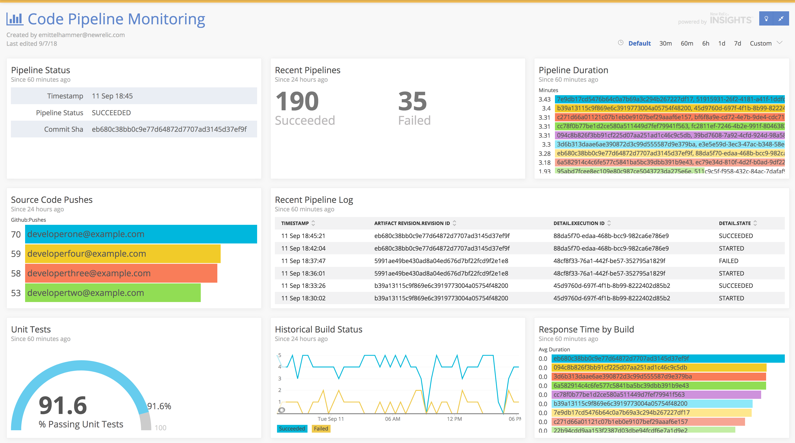
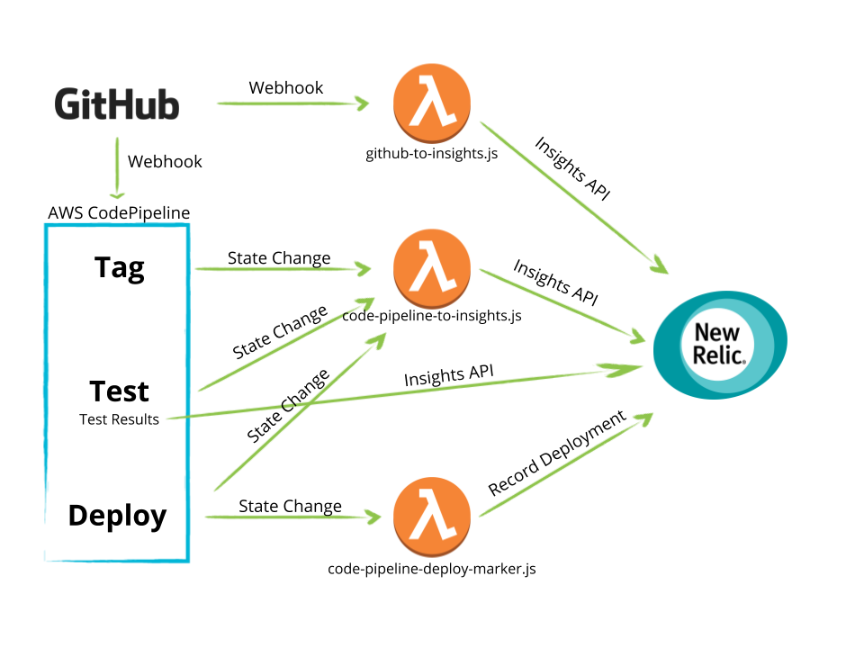

# Code Pipeline Webinar Demo App
This is the example code that is a companion to New Relic's [Best Practices for Measuring Your Code Pipeline Webinar](https://newrelic.com/webinar/best-practices-code-pipeline-180912)

It contains a simple service written in Node.js as well as all of the "glue code" and event handlers you'll need to push data from GitHub and AWS to New Relic.

## Overview
The reference implementation here uses [AWS CodePipeline](https://aws.amazon.com/codepipeline/) to manage the flow of an application that is sourced in GitHub, built and tested with [AWS CodeBuild](https://aws.amazon.com/codebuild/), and deployed with [Elastic Beanstalk](https://aws.amazon.com/elasticbeanstalk/)

The approach is similar to the one documented [here](https://docs.aws.amazon.com/codebuild/latest/userguide/how-to-create-pipeline.html).

The tools and products used here were chosen as examples to illustrate the _concepts_ around the types of data and events you should be thinking about when instrumenting your own code pipeline.  The sample code should be generic enough to be adapted to any toolset.

### High-Level data flow

### Description
1. Pipeline execution is initiated via SCM activity.  In this case, we are using [GitHub webhooks](https://developer.github.com/webhooks/) to [notify CodePipeline that a new revision has been pushed](https://docs.aws.amazon.com/codepipeline/latest/userguide/pipelines-webhooks-migration.html).  Additionally, we send the same [push event](https://developer.github.com/v3/activity/events/types/#pushevent) to a [Lambda function](./lambda/github-to-insights.js) that will properly format the event and send it to New Relic Insights.

2. Each stage of the pipeline will emit an event when it transitions through states (`STARTED`, `CANCELLED`, `FAILED`, `SUCCEEDED`, for ex.).  We'll push these state changes to New Relic Insights using CloudWatch Events as described [here](https://docs.aws.amazon.com/codepipeline/latest/userguide/detect-state-changes-cloudwatch-events.html). Again, we'll have to use an intermediary [Lambda function](./lambda/code-pipeline-to-insights.js) to properly format the events.

3. In the "Build" stage of the pipeline, we'll execute a [pipeline action](https://docs.aws.amazon.com/codepipeline/latest/userguide/actions.html) that uses a CodeBuild build step to ["tag" our application](./buildspecs/tag-source.yml) with the build id and source code revision.  This allows us to [attach these attributes](./server.js#L36) to any application events or metrics collected by the New Relic APM agent.  If this were an application that required a compilation step, etc, that would be done here as well.

4. The next action of the "Build" stage [runs the application unit tests](./buildspecs/unit-tests.yml) and writes the results to disk. It contains a post-build hook that will load the results and send them to New Relic Insights.

5. The final stage of the pipeline is a "Deploy" stage in which the output of step 3 (a tagged build) is deployed to a runtime environment. In addition to capturing the CodePipeline state change event that we set up previously, we'll set up another CloudWatch rule that matches _only_ the "Deploy" actions states that have status `SUCCEEDED`, to which we will send to the New Relic REST API to [record a deployment](https://docs.newrelic.com/docs/apm/new-relic-apm/maintenance/record-deployments) via a third [lambda function](./lambda/code-pipeline-deploy-marker.js)

## Themes
YMMV may vary depending on your organizational workflow, tool set, application stack, and runtime environment. However, these general themes apply:
- Capture timestamped changes to SCM with at least the author and the hash or unique change ID.  Propogate this wherever possilbe.
- Capture timestamped state chages to your pipeline/CI/CD system indicating when that stage started, and whether it succeeded or failed.  This makes an easy alert condition and is the basis for observing improvements to process over time (increasing deploy frequency, build quality, etc).
- Report the results of unit tests to Insights.  If possible, also report qualitative statistics such as code coverage %.
- Attach the build or revision identifier as a custom attribute in APM, this will help when diagnosing and troubleshooting performance issues and errors.  It will become particularly valuable in situations where you have to review or analyze builds and deployments that may have happened days or weeks ago.
- Record successful deployments via the New Relic REST API.  This will add a visual deployment marker to charts in APM, allowing you quickly correlate variations in performace to application changes.
