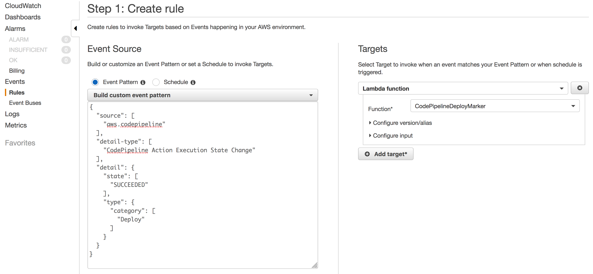
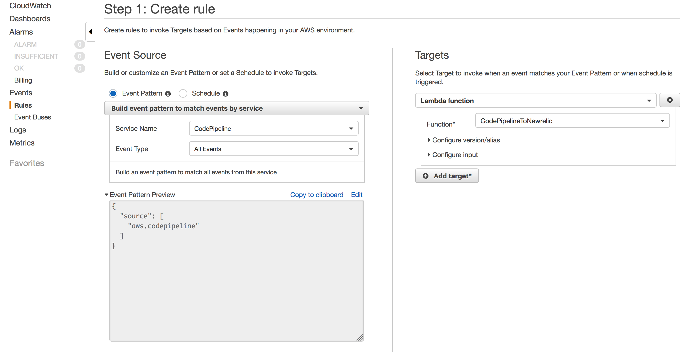

# Lambda Functions
A set of AWS Lambda functions that are used to augment and format data befor sending to New Relic

## Deploy Markers
[code-pipeline-deploy-marker.js](./code-pipeline-deploy-marker.js)

The trigger to this function should be a CloudWatch Event that fires when the `Deploy` Action of your pipeline changes to state `SUCCEEDED`

## Code Pipeline Events to Insights
[code-pipeline-to-insights.js](./code-pipeline-to-insights.js)

Used to reformat the state change events from CodePipeline and send to New Relic Insights.

Trigger should be a CloudWatch Events rule that matches all CodePipleline state changes

## GitHub to Insights
[github-to-insights.js](./github-to-insights.js)

Used to reformat GitHub push events before sending to New Relic Insights.

This function must be exposed via an API Gateway trigger which will be the recipient of a GitHub webhook.

### Ref:

[New Relic Insights API](https://docs.newrelic.com/docs/insights/insights-data-sources/custom-data/insert-custom-events-insights-api)

[GitHub Webhooks](https://developer.github.com/webhooks/)

[AWS CodePipeline Events](https://docs.aws.amazon.com/codepipeline/latest/userguide/detect-state-changes-cloudwatch-events.html)

[Using ApiGateway with Lambda](https://docs.aws.amazon.com/apigateway/latest/developerguide/getting-started-with-lambda-integration.html)

